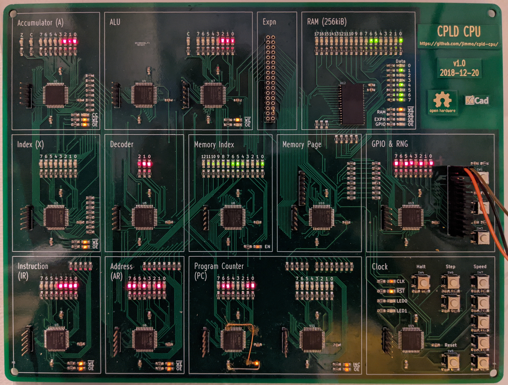

## CPLD CPU

This is a project to create a demonstration CPU that is simple enough to be able to watch its execution but also able to do something almost useful.

It was inspired by the following five projects:
 - [Fourbit, by Jaromir Sukuba](http://jaromir.xf.cz/fourbit/fourbit.html). This is a 4-bit CPU made entirely from 74xx series logic.
 - [Tiny CPU in a CPLD, by Big Mess o' Wires](https://www.bigmessowires.com/cpu-in-a-cpld/). This implements a whole CPU inside a single Altera CPLD.
 - [MCPU, by Tim Böscke](https://github.com/cpldcpu/MCPU) (and [writeup, by Jean-Claude Wippler](https://jeelabs.org/2017/11/tfoc---a-minimal-computer/)). Similar to above, but using the exact CPLD that I was intending to use, and with a really well-documented and practical ISA.
 - [The Megaprocessor, by James Newman](http://megaprocessor.com/). "The Megaprocessor is a micro-processor built large. Very large." Each gate is made from through-hole transistors with LEDs on all inputs and outputs.
 - [monster6502, by TubeTime & Evil Mad Scientist Laboratories](https://monster6502.com/). A working replica of the 6502 using discrete SMT transistors, complete with loads of LEDs.

In particular the CPU design (ISA and architecture) is inspired by Fourbit, Tiny CPU, and especially MPU, while the exploded design and "LEDs everywhere" is inspired by the Megaprocessor and monster6502. While nowhere near as capable as monster6502 or the Megaprocessor, it is definitely much more budget-friendly! And it can still [compute prime numbers](pysim/cpu_ax_13/tests/primes.s) ([video](https://www.youtube.com/watch?v=ZP9e-FCwwOs)) and [drive APA102 LED strips](pysim/cpu_ax_13/tests/apa102c.s).

Also, while not a direct inspiration to this project, it's absolutely worth linking to [Breadboard 8-bit computer, by Ben Eater](https://eater.net/8bit) which is a wonderful series about a similar project.

## History

This idea started when I was teaching an introduction to "how CPUs work", and wanted something tangible to show my students. The goal is to show how simple logic circuits (i.e. starting with AND and OR gates, flip flops, and a clock) can work together to do computation. No magic required.

Initially I planned to exactly replicate the Fourbit (possibly upgraded to 8-bit), but had trouble sourcing the 74181 ALU. I found a [XC9572XL CPLD development board](http://dangerousprototypes.com/blog/2011/03/29/new-prototype-xc9572xl-cpld-development-board/) in my board collection and considered replicating the 74181 on that. CPLDs are really useful for a project like this because they do not require external flash for configuration. You can use them almost as a complete drop-in replacement. However, at this point if you're not constraining yourself to using exactly 74xx series parts, then there are several simplifications you can make in the Fourbit design.

So I set about designing a CPU where each functional component is its own CPLD. In some ways this is similar to designing a soft-CPU for an FPGA, but with the additional constraint that signals between components actually need to go via physical pins. For an 8-bit CPU, this uses up a lot of pins very quickly.

For a fun side-quest, I wrote a [logic simulator](pysim) that allows a logic circuit to be defined in Python, and simulated, much the same way that [Verilator](https://www.veripool.org/verilator/) can simulate an HDL file. This allowed me to test and iterate on some different designs, including an [exact clone of the MCPU design](pysim/cpu_a_6). Additionally the simulator allows me to stay closer to my original goal of being able to describe every logic gate, although some shortcuts were taken.

The [final design](pysim/cpu_ax_13) expands on the MCPU design, including 13-bit addressing, an index register, two-byte instruction encoding, a primitive MMU allowing addressing up to 1MiB of physical RAM, and memory-mapped IO. The memory is von Neumann, allowing for RAM and ROM to share the same bus. The simulator allowed some [programs to be written](pysim/cpu_ax_13/tests) and tested, including an assembler supporting some macro commands.

Once that was working, I translated each Python component into VHDL, and tested it on the CPLD breakout board. For example, here's the decoder ([Python](pysim/cpu_ax_13/cpu.py#L51) and [VHDL](gateware/decoder/decoder.vhd)). The most difficult part of this process, and possibly the whole project, was [uploading the gateware to the CPLD](https://blog.jimmo.id.au/2018/11/26/programming-a-xc9500xl-cpld-with-a-raspberry-pi.html). In order to keep the design simple, the clock is generated by a ring oscillator in the clock CPLD, which is a terrible idea in general but works well here.

Finally, I designed [a schematic](hardware/schematic.pdf) and [PCB layout](hardware), which mostly involved laying out 131 LEDs (and their current limiting resistors). Rather than putting both RAM and ROM into the design, it just has a single RAM chip. This means that it has no persistent program storage, and the program needs to be loaded by an external programmer (implemented using some spare pins on the memory controller).

It's a four-layer PCB and can be assembled by hand with an iron or hot air. The CPLDs are TQFP and the LEDs and resistors are all 0805.

Other than occasionally being used for teaching, I mostly keep it mounted on the wall with the clock speed set to \~5Hz, forever [computing prime numbers](pysim/cpu_ax_13/tests/primes.s). It's quite mesmerizing to [watch](https://www.youtube.com/watch?v=ZP9e-FCwwOs)!

## Features

 - All internal state visible via 131 LEDs. This includes:
   - A, X, PC, Instr, and Addr registers (including carry & zero flags).
   - Data bus (and output/input state of each connected component)
   - Memory address
   - Clock
   - Decoder state
   - GPIO
 - 8-bit accumulator
 - 8-bit index register
 - 16-bit program counter
 - 8 instructions (nor a, add a, sta, jcc, nor x, add x, stx, jnz)
 - Variable-speed clock (Hz to >100kHz), including single-instruction and single-cycle step.
 - Expansion header (allowing for memory-mapped peripherals)
 - 8-bit memory-mapped GPIO port (input and output, with jumpered LEDs on each)
 - Serial programming header

## Instruction set

The instruction set is heavily inspired by MCPU. See their [project description](https://github.com/cpldcpu/MCPU/blob/master/mcpu.pdf?raw=true) and [blog post](https://jeelabs.org/2017/11/tfoc---a-minimal-computer/) for more information. The main extension is the addition of the index register (X) as well as a jump-non-zero.

### Hardware instructions

#### nor [mem]
`A = A nor [mem + X]`

#### add
`A = A + [mem + X]`

#### sta
`[mem + X] = A`

#### jcc
Jump if carry not set.

#### norx
`X = X nor [X]`

#### addx
`X = X + [mem]`

#### stx
`[mem] = X`

#### jnz
Jump if zero flag not set.

#### Pseudo instructions

These are supported by the assembler and generate a sequence of real instructions.

#### clr
`A = 0`

#### lda
`A = [mem]`

#### not
`A = ~A`

#### sub
`A = A - [mem + X]`

#### clrx
`X = 0`

#### ldx
`X = [mem]`

#### notx
`X = ~X`

#### subx
`X = X - [mem]`

#### jmp
Unconditional jump

#### jcs
Jump if carry flag set

#### jz
Jump if zero flag set

#### shl
`A = A << 1`

#### inc
`A = A + 1`

#### dec
`A = A - 1`

#### and
`A = A & [mem + X]`

#### or
`A = A | [mem + X]`

#### nand
`A = ~(A & [mem + X])`

#### xnor
`A = ~(A ^ [mem + X])`

#### xor
`A = A ^ [mem + X]`

#### ldpg
Sets the current memory page

#### hlt
Infinite loop

#### out
(Simulator only) prints A to stdout

## Programming

There's a [MicroPython script](programmer) that can load a assembled binary via the serial programming interface (header is next to the memory controller).

## TODO

 - Much more documentation and assembly guide (I'd love to do a video series one day)
 - Better demos
 - A higher-level compiler, making better use of the MMU
 - Design a peripheral to use the expansion connector
 - Use an external clock (and find out how fast this can go).

## Ideas for future revisions

 - Separate net for the LED ground (allowing it to be disconnected).
 - Fix the missing PC_LOW LED (bodged in on the current board)
 - More LEDs (e.g. ALU current operation)
